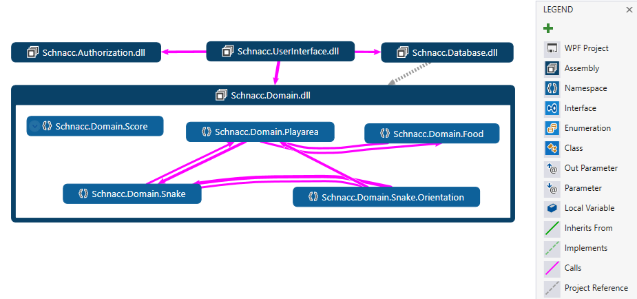

[](https://sonarcloud.io/summary/new_code?id=daerup_Schnacc)
[](https://sonarcloud.io/summary/new_code?id=daerup_Schnacc)
[](https://sonarcloud.io/summary/new_code?id=daerup_Schnacc)
[](https://sonarcloud.io/summary/new_code?id=daerup_Schnacc)

# Schnacc
A simple snake game written in C# using the .NET framework. 
This project is used for the course SWAT and will refactored and extended during the course. 

## Rules
Eat the food to grow the snake and gain points. Play live agains other players and see their highscores pop up in your side bar. 

Play strategically and do not move unnecessarily, as you will loose points for every move you make.
The further you progress, the faster the snake will move.

Too fast? Activate slow motion in exchange for points and take a breath.

Controls:
- <kbd>↑</kbd> Move up
- <kbd>↓</kbd> Move down
- <kbd>←</kbd> Move left
- <kbd>→</kbd> Move right
- <kbd>Space</kbd> Activate slow motion

The controls are buffered, so you can press keys in rapid succession and the snake will move the buffered directions in order after every game tick.

>**Note**: Only logged in players with verified email addresses get to have their highscores saved.

# Run
To run the game, clone the repository and open the solution in Visual Studio or your preferred IDE.

Edit `secret.json` and add the firebase api key. Alternatively you can utilize the offline mode.
For this set the ``secrets.json`` file to:

```json
{
  "AuthConfig": {
    "ApiKey": "offline"
  }
}
```

Afterwards, build the solution and run the project `Schnacc.UserInterface`.
# Architecture
The UI is implemented using WPF and the MVVM pattern. The solution was originally designed to follow the Onion Architecture. In hindsight, I am not 100% sure if the splits are made correctly.



## Architecture Decisions Records (ADR)
### Upgrade to .NET Core
---

#### Context and Problem Statement

Upgrade from deprecated .NET Framework to .NET Core, to also support Linux and MacOS. For this, the integration tests (written in xBehave) need to be rewritten, since xBehave does not support .NET Core.

#### Considered Options

* recreate the integration tests in SpecFlow
* remove the integration tests
* dont upgrade to .NET Core

#### Decision Outcome

Automatic conversion of the xBehave tests is not possible. The effort to recreate the integration tests in .NET Core is too high. The upgrade is postponed.

---
